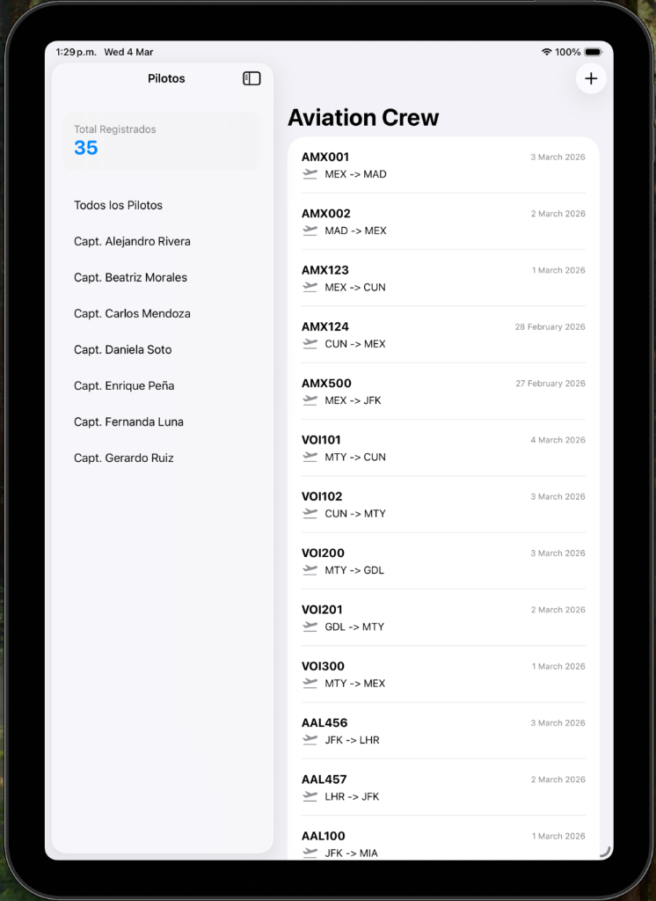
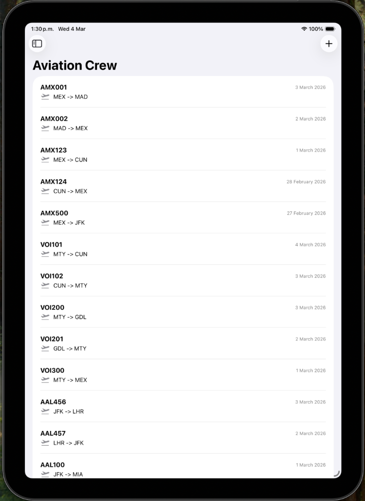
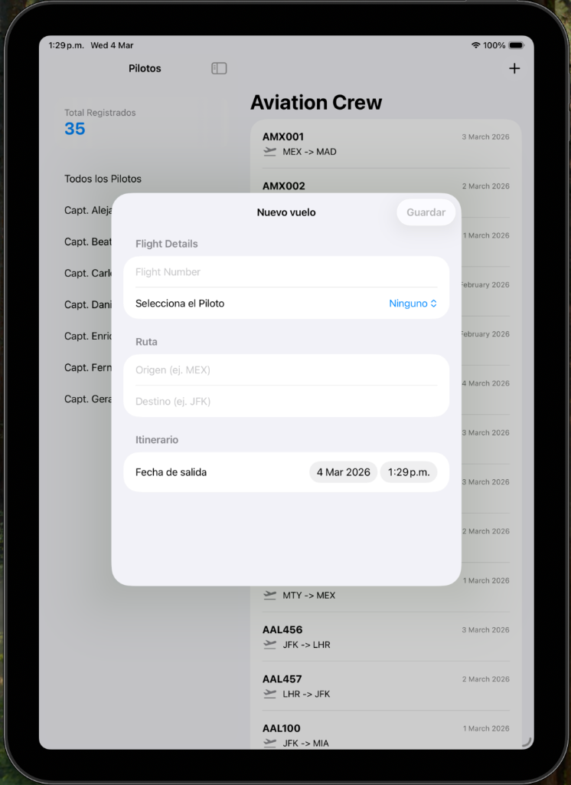
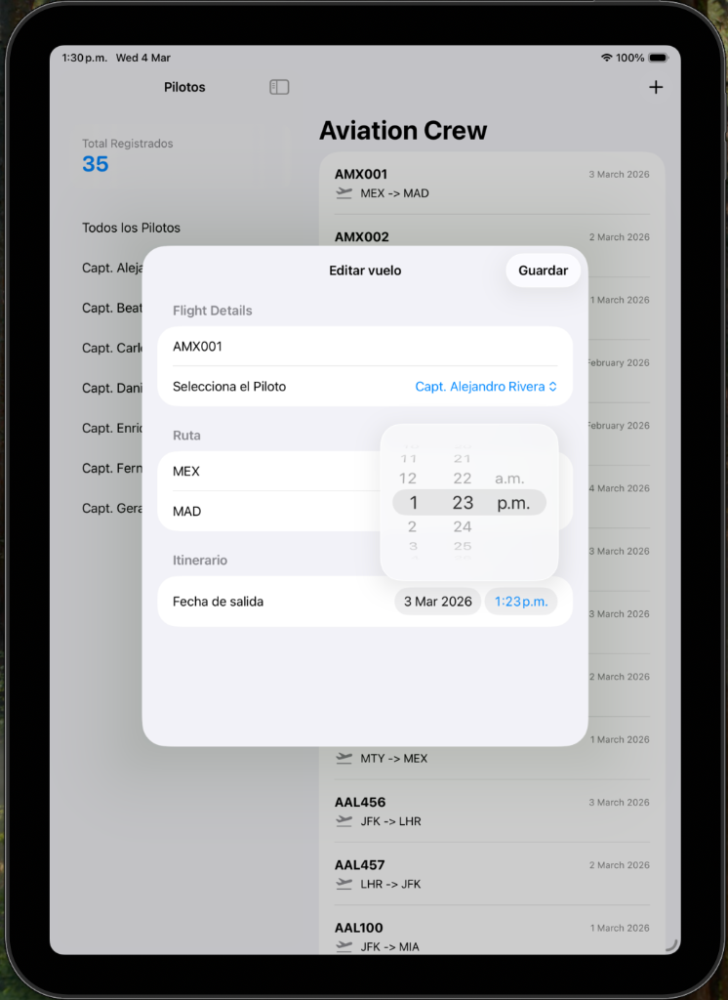

# Aviation Crew - iOS PoC

## 🚀 Mi Transición: De .NET a iOS
Este proyecto representa un hito importante en mi desarrollo profesional: el salto de un ecosistema maduro como **.NET** hacia el desarrollo nativo con **Swift e iOS**. 

Como desarrollador con experiencia previa en C# y .NET, este reto personal me ha permitido explorar nuevas arquitecturas y paradigmas de diseño, adaptando principios sólidos (como SOLID y Clean Architecture) a las herramientas modernas de Apple como **Swift 6** y **SwiftUI**.

## ✈️ Sobre el Proyecto (PoC)
**Aviation Crew** es una **Prueba de Concepto (PoC)** diseñada para la gestión eficiente de bitácoras de vuelo. La aplicación permite a los pilotos y tripulaciones llevar un registro detallado de sus operaciones aéreas de manera fluida y nativa.

### 🌟 Características Principales
- **Gestión de Vuelos**: Registro detallado de número de vuelo, piloto, origen, destino y fecha.
- **Filtrado Inteligente**: Capacidad de organizar y visualizar vuelos por piloto.
- **Interfaz Adaptativa**: Diseño optimizado para iPhone, iPad y macOS.

## 📱 Visuales de la Aplicación

  
  
   
  
  

## 🛠️ Stack Tecnológico y Arquitectura

### 💾 Persistencia de Datos
En esta fase de PoC, implementé una capa de persistencia robusta utilizando el sistema de archivos de iOS:
- **Tecnología**: `Codable` + `JSONEncoder` / `JSONDecoder`.
- **Estrategia**: Los datos se almacenan en el directorio de `Documents` de forma atómica, garantizando que el estado se mantenga entre sesiones de uso.
- **Decisión de Diseño**: Opté por esta solución manual para profundizar en el ciclo de vida de los datos en iOS y la gestión del `FileManager` antes de migrar a SwiftData.

### 🎨 Diseño y Navegación
- **Navegación**: Utilizo un flujo moderno basado en `NavigationSplitView` (para soporte multicolumna en iPad) y `NavigationStack` para la navegación jerárquica.
- **Arquitectura**: Patrón **MVVM** (Model-View-ViewModel) aprovechando la macro `@Observable` para una reactividad eficiente y desacoplada.
- **UI UX**: Componentes nativos de SwiftUI que respetan las **Human Interface Guidelines (HIG)**, asegurando una experiencia familiar para el usuario de Apple.

## 🏁 Estado del Reto
Este es un proyecto vivo y funcional que demuestra mi capacidad de adaptación técnica y mi compromiso con la excelencia en el desarrollo móvil. ¡Gracias por acompañarme en este vuelo hacia iOS!
